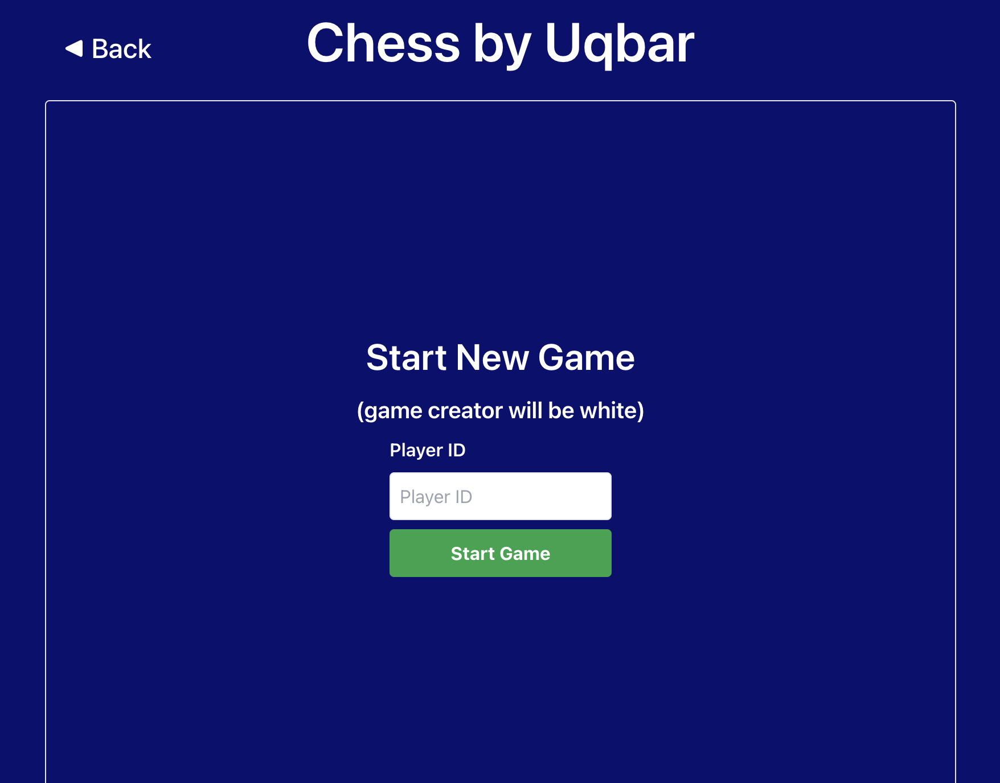

# Putting Everything Together

After adding a frontend in the previous chapter, your chess game is ready to play.

Hopefully, you've been using `kit build <your_chess_app_name>` to test the code as the tutorial has progressed.
If not, do so now in order to get a compiled package you can install onto a node.

Next, use `kit start-package <your_chess_app_name> -p <your_test_node_port>` to install the package.
You should see the printout you added to `init()` in your terminal: `my-chess:my-chess:template.os: start`.

Remember that you determine the process names via the `manifest.json` file inside `/pkg`, and the package & publisher name from `metadata.json` located at the top level of the project.
Open your chess frontend by navigating to your node's URL (probably something like `http://localhost:8080`), and use the names you chose as the path.
For example, if your chess process name is `my-chess`, and your package is named `my-chess`, and your publisher name is `template.os` (the default value), you would navigate to `http://localhost:8080/my-chess:my-chess:template.os`.

You should see something like this:

To try it out, boot up another node, execute the `kit start-package` command, and invite your new node to a game.
Presto!

This concludes the main Chess tutorial.
If you're interested in learning more about how to write Kinode processes, there are several great options to extend the app:

- Consider how to handle network errors and surface those to the user
- Add game tracking to the processes state, such that players can see their history
- Consider what another app might look like that uses the chess engine as a library.
Alter the process to serve this use case, or add another process that can be spawned to do such a thing.

There are also extensions to this tutorial which dive into specific use cases which make the most of Kinode:

- [Chat](./chat.md)
- [more coming soon](#)

The full code is available [here](https://github.com/kinode-dao/kinode/tree/main/kinode/packages/chess).