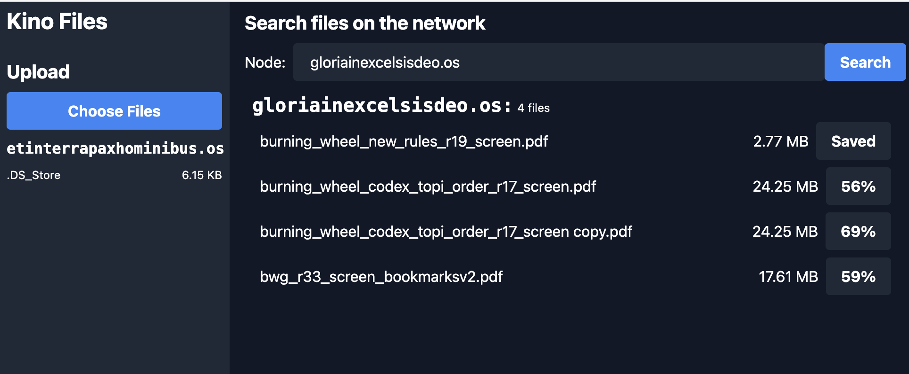

# Kino Files (File Transfer + UI)

This entry will teach you to add a simple UI to the [file transfer app](./file_transfer.md), using [`kit`](../kit/kit-dev-toolkit.md)'s built-in UI template.

This guide assumes a basic understanding of Kinode process building, some familiarity with [`kit`](../kit/kit-dev-toolkit.md), requests and responses, and some knowledge of Rust syntax.
It's also strongly recommended that you read and understand the [file transfer app](./file_transfer.md) before continuing.

## Contents

- [Start](#start)
- [File Transfer](#file-transfer)
- [UI](#ui)
- [Next Steps](#next-steps)
- [Github Repo](https://github.com/bitful-pannul/file_transfer)

## Start

Create a new project with `kit`, passing the `--ui` flag:

```bash
kit new file_transfer --ui
```

This will create a new project with a `ui` directory for the Vite/React UI code, in addition to the `file_transfer` directory where the usual Rust code will be located.

## File Transfer

The file transfer app is a simple app that allows users to upload and download files to and from their node.
It's a good example of a simple app that can be built on Kinode.

### Existing Features

The file transfer app already has the following features:

- upload files to your node's [VFS](../apis/vfs.md)
- list the files on your node
- search for and list the files on other nodes
- download files from other nodes to yours
- display download progress

You just need to build a UI to take advantage of these capabilities.

## UI

`kit` has a built-in UI template that you can use to build your UI.
The UI template is a simple [React](https://reactjs.org/) app that uses [Vite](https://vitejs.dev/) as a build tool.

Our objective is a UI that looks something like this:



### Needed Features

Our UI will need to enable all of the above features.

### Vite

You will develop your UI on [Vite](https://vitejs.dev/), a fast, opinionated frontend build tool.
It's like [Webpack](https://webpack.js.org/), but faster and with less configuration.
If you've never used Vite before, check out the [docs](https://vitejs.dev/guide/).

### Build it!

To build the UI, run `kit build` (or just `kit b`).
This will build the UI and copy the files into the `pkg/ui` directory, then build `file_transfer` as usual.
The UI will be served from `http://localhost:8080` (or your custom node URL/port) at `/file_transfer:file_transfer:template.os`.
However, you will need to configure Vite to allow your UI to communicate seamlessly with the `file_transfer` app on your node.

### Configure Vite

You will be configuring your Vite environment in order to enable development on Kinode.
This step is necessary to allow your *development* UI (which will change often, and rebuild quickly) to communicate with the `file_transfer` app on your node (which will change rarely, and rebuild slowly).

#### Example `vite.config.ts`
```ts
import { defineConfig } from 'vite'
import react from '@vitejs/plugin-react'

// BASE_URL is process_name:package_name:publisher_node.
// It represents the URL where the UI will be served from.
// If your node is running on localhost, you will access the UI at http://localhost:3000/process_name:package_name:publisher_node.
import manifest from '../pkg/manifest.json'
import metadata from '../pkg/metadata.json'
const BASE_URL = `${manifest.process_name}:${manifest.package}:${metadata.publisher}`

// This is the proxy URL, it must match the node you are developing against
const PROXY_URL = (process.env.VITE_NODE_URL || 'http://127.0.0.1:8080').replace('localhost', '127.0.0.1');

export default defineConfig({
  plugins: [react()],
  base: BASE_URL,
  build: {
    rollupOptions: {
      external: ['/our.js']
    }
  },
  server: {
    open: true,
    proxy: {
      // '/our' is an endpoint that simply serves your node's name via GET.
      '/our': {
        target: PROXY_URL,
        changeOrigin: true,
      },
      // 'our.js' is a js file containing information about your node, which will be used by your UI.
      [`${BASE_URL}/our.js`]: {
        target: PROXY_URL,
        changeOrigin: true,
        rewrite: (path) => path.replace(BASE_URL, ''),
      },
      // This route will match all other HTTP requests to the backend: when your ui makes a request to BASE_URL, it will be proxied to your node.
      [`^${BASE_URL}/(?!(@vite/client|src/.*|node_modules/.*|@react-refresh|$))`]: {
        target: PROXY_URL,
        changeOrigin: true,
      },
    }
  }
});
```

#### Example `index.html`

You only need to change one line in the default `index.html` file: Add `<script type="module" src="/our.js"></script>` to the `<head>`.

```html
<!doctype html>
<html lang="en">
  <head>
    <meta charset="UTF-8" />
    <link rel="icon" type="image/svg+xml" href="/vite.svg" />
    <meta name="viewport" content="width=device-width, initial-scale=1.0" />
    <title>Vite + React + TS</title>

    <!-- Add this line -->
    <script src="/our.js"></script>

  </head>
  <body>
    <div id="root"></div>
    <script type="module" src="/src/main.tsx"></script>
  </body>
</html>

```

So much for the Vite configuration.
Now let's look at the UI code.

### Example UI Code

The UI is built on [React](https://reactjs.org/), a popular frontend framework.
If you've never used React before, check out the [docs](https://reactjs.org/docs/getting-started.html).

### Types and Stores

You will use [Zustand](http://npmjs.org/package/zustand) to manage your state.
Zustand is a simple state management library that uses React hooks.
If you've never used Zustand before, check out the [docs](https://github.com/pmndrs/zustand?tab=readme-ov-file).

#### `ui/src/types/KinoFile.ts`

This interface represents a file in your UI.
It doesn't need much, because most of the information about the file is stored on your node.

```ts
interface KinoFile {
    name: string,
    size: number,
}

export default KinoFile;
```

#### `ui/src/store/fileTransferStore.ts`

The `fileTransferStore` is a Zustand store that will manage your state.

```ts
import { create } from 'zustand'
import { persist, createJSONStorage } from 'zustand/middleware'
import KinoFile from '../types/KinoFile'
import KinodeEncryptorApi from '@uqbar/client-encryptor-api'

export interface FileTransferStore {
  // handleWsMessage is a function that will be called when the websocket receives a message.
  handleWsMessage: (message: string) => void

  // the list of files in your node's VFS
  files: KinoFile[]
  setFiles: (files: KinoFile[]) => void

  // filesInProgress is a map of file names to their upload progress
  filesInProgress: { [key: string]: number }
  setFilesInProgress: (filesInProgress: { [key: string]: number }) => void

  // the initialized Kinode api which you will communicate with
  api: KinodeEncryptorApi | null
  setApi: (api: KinodeEncryptorApi) => void

  // zustand's generic set function
  set: (partial: FileTransferStore | Partial<FileTransferStore>) => void
}

// ProgressMessage is the type of message you will receive from your node's websocket connection. It indicates the progress of a file upload, 0-100.
// If you wanted more complex messages, you could define a union type here.
interface ProgressMessage { name: string, progress: number }
type WsMessage = { kind: string, data: ProgressMessage }

const useFileTransferStore = create<FileTransferStore>()(
  persist(
    (set, get) => ({
      files: [],
      filesInProgress: {},
      api: null,
      setApi: (api) => set({ api }),
      setFilesInProgress: (filesInProgress) => set({ filesInProgress }),
      setFiles: (files) => set({ files }),

      handleWsMessage: (json: string | Blob) => {
        // This function will be called when the websocket receives a message.
        // Right now you only care about progress messages, but you could add more types of messages here.
        const { filesInProgress, setFilesInProgress } = get()
        if (typeof json === 'string') {
          try {
            console.log('WS: GOT MESSAGE', json)
            const { kind, data } = JSON.parse(json) as WsMessage;
            if (kind === 'progress') {
              // If you receive a progress message, update the progress of the file in filesInProgress.
              // This will show up in the UI as a percentage.
              const { name, progress } = data
              const fip = { ...filesInProgress, [name]: progress }
              console.log({ fip })
              setFilesInProgress(fip)
            }
          } catch (error) {
            console.error("Error parsing WebSocket message", error);
          }
        } else {
            console.log('WS: GOT BLOB', json)
        }
      },
      set,
      get,
    }),
    {
      name: 'file_transfer', // unique name
      storage: createJSONStorage(() => localStorage), // (optional) by default, 'localStorage' is used. You could use 'sessionStorage' or any other storage.
    }
  )
)

export default useFileTransferStore
```

### Style

We'll use [Tailwind CSS](https://tailwindcss.com/) for styling.
This is a popular CSS framework that allows you to style your app using only CSS classes.
If you've never used Tailwind before, check out the [docs](https://tailwindcss.com/docs)!

#### Installing Tailwind

First, install Tailwind and its dependencies:

```bash
# npm:
npm install -D tailwindcss@latest postcss@latest autoprefixer@latest classnames
# yarn:
yarn add -D tailwindcss@latest postcss@latest autoprefixer@latest classnames
```

Next, create a Tailwind config file:

```bash
npx tailwindcss init -p
```

This will create a `tailwind.config.js` file in your project's root directory.

#### Configuring Tailwind

Next, you need to configure Tailwind to purge unused styles in production.
This will reduce the size of your CSS bundle.

Open `tailwind.config.js` and add the following:

```js
module.exports = {
  purge: ['./index.html', './src/**/*.{js,jsx,ts,tsx,vue}'],
  darkMode: false, // or 'media' or 'class'
  theme: {
    extend: {},
  },
  variants: {
    extend: {},
  },
  plugins: [],
}
```

#### Importing Tailwind

Finally, you need to import Tailwind in your `index.css` file:

```css
@tailwind base;
@tailwind components;
@tailwind utilities;
```

### UI Code

#### `ui/src/App.tsx`

This is the main UI component.
We'll want to show the files on your node, the files on other nodes, and a way to upload files to your node.

```ts
import { useEffect, useState } from 'react'
import './App.css'
import MyFiles from './components/MyFiles'
import KinodeEncryptorApi from '@uqbar/client-encryptor-api'
import useFileTransferStore from './store/fileTransferStore';
import SearchFiles from './components/SearchFiles';

// This global declaration allows us to access the name of your node and process in a type-safe way.
// These fields are populated by `/our.js`, which is served by your node, and fetched automatically by index.html.
declare global {
  var window: Window & typeof globalThis;
  var our: { node: string, process: string };
}

// Don't init the websocket connection more than once.
let inited = false

function App() {
  // filesToUpload is a list of files that the user has selected to upload.
  const [filesToUpload, setFilesToUpload] = useState<File[]>([])
  const { files, setFiles, handleWsMessage, setApi } = useFileTransferStore();

  // BASE_URL is the endpoint on which your node is serving the UI.
  const BASE_URL = import.meta.env.BASE_URL;
  // PROXY_TARGET is the URL where your node is running.
  const PROXY_TARGET = `${(import.meta.env.VITE_NODE_URL || "http://localhost:8080")}${BASE_URL}`;
  // WEBSOCKET_URL is the URL where your node's websocket is running, e.g. ws://localhost:8080.
  const WEBSOCKET_URL = import.meta.env.DEV
  ? `${PROXY_TARGET.replace('http', 'ws')}`
  : undefined;

  // Set your node and process names in the global window object.
  if (window.our) window.our.process = BASE_URL?.replace("/", "");

  // This effect will run once, when the component is mounted.
  useEffect(() => {
    if (!inited) {
      inited = true

      // Connect to your node's websocket for this process.
      const api = new KinodeEncryptorApi({
        uri: WEBSOCKET_URL,
        nodeId: window.our.node,
        processId: window.our.process,
        onMessage: handleWsMessage
      });

      setApi(api);
    }
  }, [])

  // This function is called when the user selects files to upload.
  const onAddFiles = (event: React.ChangeEvent<HTMLInputElement>) => {
    if (event.target.files) {
      setFilesToUpload(Array.from(event.target.files))
    }
  }

  // This function refreshes the files on your node's VFS.
  const refreshFiles = () => {
    fetch(`${BASE_URL}/files`)
      .then((response) => response.json())
      .then((data) => {
        try {
          setFiles(data.ListFiles)
        } catch {
          console.log("Failed to parse JSON files", data);
        }
      })
  }

  useEffect(() => {
    refreshFiles()
  }, [])

  // When you click the upload button, POST the queued files to your node.
  const onUploadFiles = () => {
    const formData = new FormData()
    filesToUpload.forEach((file) => {
      formData.append('files', file)
    })

    fetch(`${BASE_URL}/files`, {
      method: 'POST',
      body: formData,
    })
      .then(() => {
        refreshFiles()
      })
  }

  return (
    <div className='flex text-white'>
      <div className='flex flex-col w-1/4 bg-gray-800 h-screen sidebar'>
        <h2 className='text-2xl font-bold px-2 py-1'>Kino Files</h2>
        {/*
          This is the sidebar.
        */}
        <div className='flex flex-col mt-4'>
          <h3 className='text-xl font-bold px-2 py-1'>Upload</h3>
          <div className='flex flex-col px-2 py-1'>
            {/*
              This button opens a file selection dialog.
              When the user selects files to upload to their node, you stage them here.
            */}
            <label htmlFor='files' className='bg-blue-500 hover:bg-blue-700 font-bold py-2 px-4 rounded cursor-pointer text-center'>
              Choose Files
              <input id='files' type='file' hidden multiple onChange={onAddFiles} />
            </label>

            {/*
              If you have selected files to upload, show them here.
              When you click the upload button, you POST the files to the node.
            */}
            {filesToUpload.length > 0 && (
              <div className='flex flex-col px-2 py-1'>
                <div className='flex flex-row justify-between px-2 py-1'>
                  <span>{filesToUpload.length} files selected</span>
                  <span>{filesToUpload.reduce((acc, file) => acc + file.size, 0)}</span>
                </div>
                <button className='bg-blue-500 hover:bg-blue-700 font-bold py-2 px-4 rounded' onClick={onUploadFiles}>
                  Upload
                </button>
              </div>
            )}
          </div>
          {/*
            Show the files on your node.
            This component is defined below.
          */}
          <MyFiles node={window.our.node} files={files} />
        </div>
      </div>
      {/*
        This is the main content area.
      */}
      <div className='flex flex-col w-3/4 bg-gray-900 h-screen content px-2 py-1'>
        {/*
          Show the files on other nodes.
          This component is defined below.
        */}
        <SearchFiles />
      </div>
    </div>
  )
}

export default App
```

####  `ui/src/components/MyFiles.tsx`

This is just a list of files.
Each file is rendered by the `FileEntry` component, which is below.

```ts
import FileEntry from './FileEntry';
import KinoFile from '../types/KinoFile';

interface Props {
  files: KinoFile[];
  node: string;
}

const MyFiles = ({ files, node }: Props) => {
    return (
        <div className='flex flex-col'>
            <h3 className='font-bold text-white px-2 py-1 font-mono'>{node}</h3>
            <div className='text-xs flex flex-col'>
            {files.length === 0
                ? <span className='text-white'>No files... yet.</span>
                : files.map((file, index) => <FileEntry node={node} key={index} file={file} />)}
            </div>
        </div>
    );
};

export default MyFiles;
```

#### `ui/src/components/FileEntry.tsx`

The `FileEntry` component renders a single file.
It shows the file name, size, and a button to download the file to your node's VFS.
It requires a `node` prop, which is the name of the node where the file is located.
Also, if the file is downloading, it shows the download progress.
Once finished, the file will be saved to your node's VFS, and you will see "Saved".

```ts
import { useEffect, useState } from "react";
import KinoFile from "../types/KinoFile";
import useFileTransferStore from "../store/fileTransferStore";
import classNames from "classnames";

interface Props {
    file: KinoFile
    node: string
}
function FileEntry({ file, node }: Props) {
    const { files: ourFiles, filesInProgress, api } = useFileTransferStore();
    const [actualFilename, setActualFilename] = useState<string>('')
    const [actualFileSize, setActualFileSize] = useState<string>('')
    const [isOurFile, setIsOurFile] = useState<boolean>(false)
    const showDownload = node !== window.our.node;

    useEffect(() => {
        // To display the filename ergonomically,
        //   you strip the `file_transfer:file_transfer:template.os/files/`
        //   prefix from the file name.
        const filename = file.name.split('/files/').pop() || '';
        setActualFilename(filename);
    }, [file.name])

    useEffect(() => {
        const fileSize = file.size > 1000000000000
            ? `${(file.size / 1000000000000).toFixed(2)} TB`
            : file.size > 1000000000
            ? `${(file.size / 1000000000).toFixed(2)} GB`
            : file.size > 1000000
            ? `${(file.size / 1000000).toFixed(2)} MB`
            : `${(file.size / 1000).toFixed(2)} KB`;
        setActualFileSize(fileSize);
    }, [file.size])

    const onDownload = () => {
        if (!file.name) return alert('No file name');
        if (!api) return alert('No api');
        api.send({
            data: {
                Download: {
                    name: actualFilename,
                    target: `${node}@${window.our.process}`
                }
            }
        })
    }

    useEffect(() => {
        if (!ourFiles) return;
        const foundFile = ourFiles.find((f) => f.name.match(file.name));
        if (foundFile) {
            setIsOurFile(true);
        }
    }, [ourFiles])

    const downloadInfo = Object.entries(filesInProgress).find(([key, _]) => file.name.match(key));
    const downloadInProgress = (downloadInfo?.[1] || 100) < 100;
    const downloadComplete = (downloadInfo?.[1] || 0) === 100;

    return (
    <div className='flex flex-row px-2 py-1 justify-between place-items-center'>
        <span className='break-all grow mr-1'>{actualFilename}</span>
        <span>{actualFileSize}</span>
        {showDownload && <button
            disabled={isOurFile || downloadInProgress || downloadComplete}
            className={classNames('font-bold py-2 px-4 rounded ml-2', {
            isOurFile, downloadInProgress, downloadComplete,
            'bg-gray-800': isOurFile || downloadInProgress || downloadComplete,
            'bg-blue-500 hover:bg-blue-700': !isOurFile && !downloadInProgress && !downloadComplete, })}
            onClick={onDownload}
        >
            {isOurFile
                ? 'Saved'
                : downloadComplete
                    ? 'Saved'
                    : downloadInProgress
                        ? <span>{downloadInfo?.[1]}%</span>
                        :'Save to node'}
        </button>}
    </div>
  );
}

export default FileEntry;
```

#### `ui/src/components/SearchFiles.tsx`

This component shows the files on other nodes.
It allows you to search for files on other nodes, and download them to your node.

```ts
import { useState } from 'react';
import KinoFile from '../types/KinoFile';
import FileEntry from './FileEntry';

const SearchFiles = function() {
    const [searchTerm, setSearchTerm] = useState('');
    const [foundFiles, setFoundFiles] = useState<KinoFile[]>([]);

    const handleSearch = () => {
        if (!searchTerm) return alert('Please enter a node name.');
        if (!searchTerm.match(/^[a-zA-Z0-9-]+\.os$/)) return alert('Invalid node name.');
        try {
            fetch(`${import.meta.env.BASE_URL}/files?node=${searchTerm}`, {
                method: 'GET',
                headers: {
                    'Content-Type': 'application/json',
                },
            }).then((response) => response.json())
            .then((data) => {
                try {
                    setFoundFiles(data.ListFiles)
                } catch {
                    console.log("Failed to parse JSON files", data);
                }
            });
        } catch (error) {
            console.error('Error:', error);
        }
    };

    return (
        <div className='flex flex-col px-2 py-1'>
            <h2 className='text-xl mb-2 font-bold'>Search files on the network</h2>
            <div className='flex place-items-center mb-2'>
                <span className='mr-2'>Node:</span>
                <input
                    className='bg-gray-800 appearance-none border-2 border-gray-800 rounded w-full py-2 px-4 text-white leading-tight focus:outline-none focus:bg-gray-800 focus:border-blue-500'
                    type="text"
                    value={searchTerm}
                    placeholder='somenode.os'
                    onChange={(e) => setSearchTerm(e.target.value)}
                />
                <button className='bg-blue-500 hover:bg-blue-700 text-white font-bold py-2 px-4 rounded' onClick={handleSearch}>Search</button>
            </div>
            {foundFiles && foundFiles.length === 0 && <span className='text-white'>No files found.</span>}
            {foundFiles && foundFiles.length > 0 && <div className='flex flex-col px-2 py-1'>
                <h2><span className='text-xl font-bold font-mono'>{searchTerm}:</span> <span className='text-xs'>{foundFiles.length} files</span></h2>
                {foundFiles.map((file) => (
                    <FileEntry node={searchTerm} key={file.name} file={file} />
                ))}
            </div>}
        </div>
    );
};

export default SearchFiles;
```

### Build it!

Now that you've written your UI code, you can build it.

1. Run `kit build` (or just `kit b`) to build the UI and file_transfer process.
1. Run `kit start-package -p 8080` (or just `kit s`) to install the package to your node running on port 8080.

In the future, you can run both of these steps in a single command, with `kit bs`.
The UI will be served from `http://localhost:8080/file_transfer:file_transfer:template.os`.

## Next Steps

Now that you've built a simple UI, you can try building your own app!
Check out the [APIs](../apis/api_reference.md) to see what's possible.

## Github Repo

You can find the full code for this example [here](http://github.com/bitful-pannul/file_transfer).
