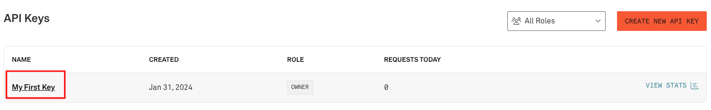
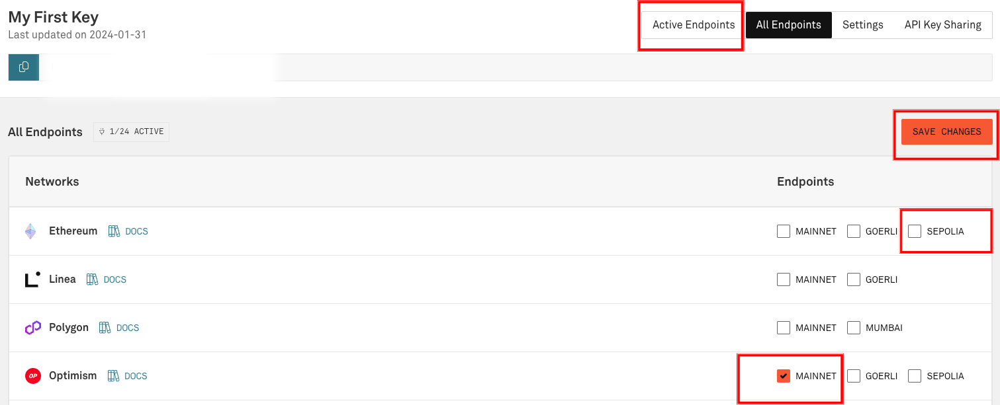
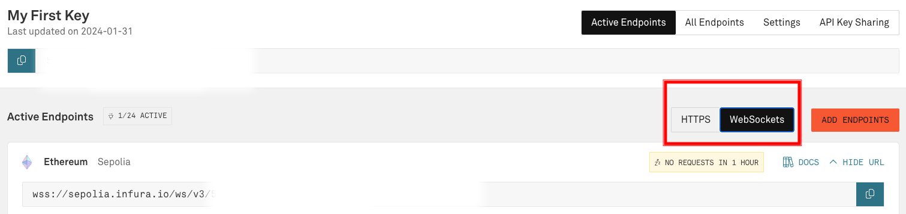
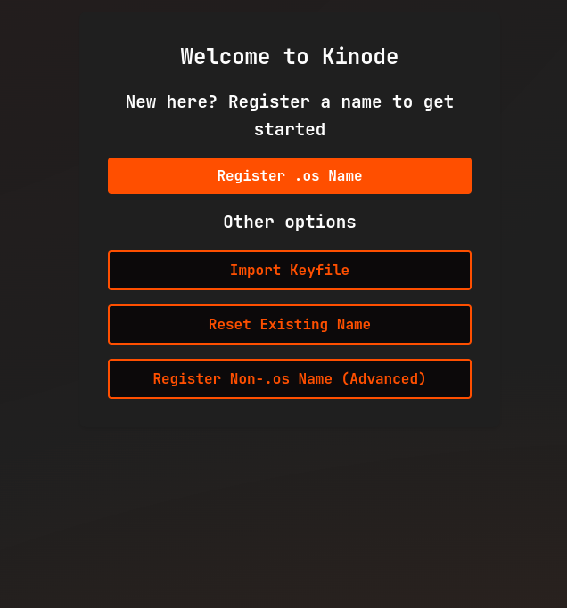
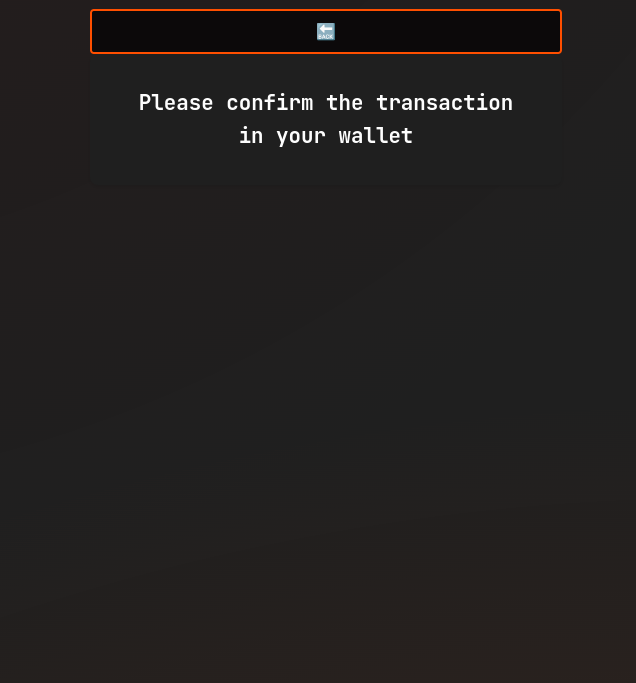
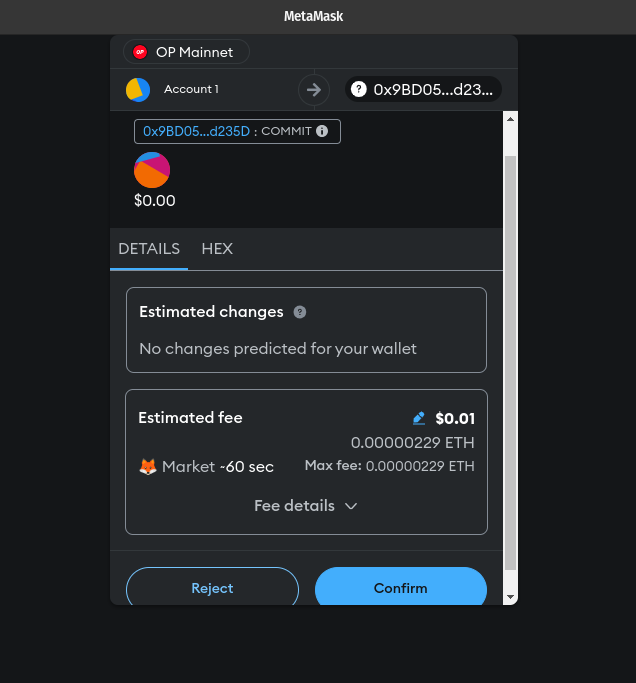
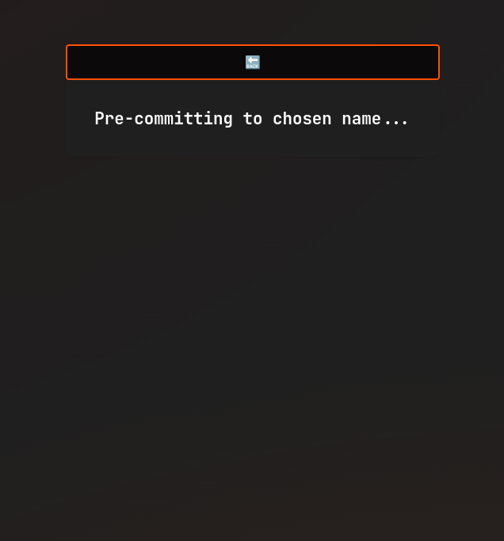
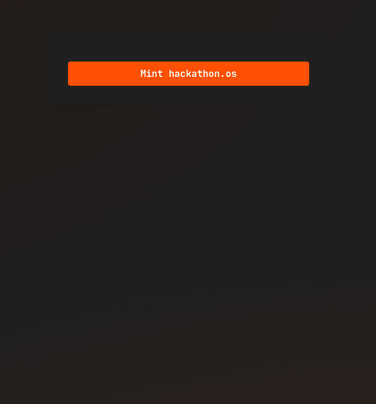
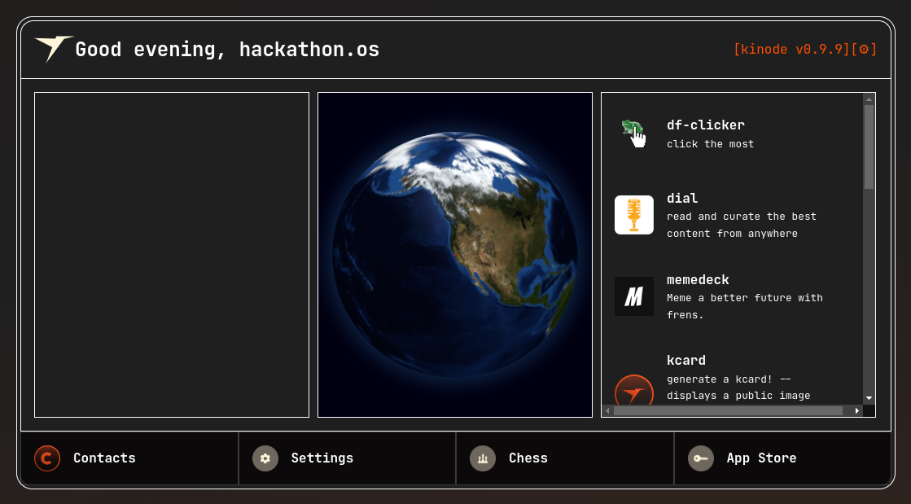

# Join the Network

This page discusses joining the network with a locally-run Kinode.
To instead join with a hosted node, see [Valet](https://valet.uncentered.systems).

These directions are particular to the Kinode beta release.
Kinode is in active development on Optimism.

## Starting the Kinode

Start a Kinode using the binary acquired in the [previous section](./install.md).
Locate the binary on your system (e.g., if you built source yourself, the binary will be in the repository at `./kinode/target/debug/kinode` or `./kinode/target/release/kinode`).
Print out the arguments expected by the binary:

```
$ ./kinode --help

DOCKER_BUILD_IMAGE_VERSION: none
PACKAGES_ZIP_HASH: 9558ea0e2180aea1afc69cbf055a4da14c51cea67fbff9cfb847533caef301fd

A General Purpose Sovereign Cloud Computing Platform

Usage: kinode [OPTIONS] <home>

Arguments:
  <home>  Path to home directory

Options:
  -p, --port <PORT>
          Port to bind [default: first unbound at or above 8080]
      --ws-port <PORT>
          Kinode internal WebSockets protocol port [default: first unbound at or above 9000]
      --tcp-port <PORT>
          Kinode internal TCP protocol port [default: first unbound at or above 10000]
  -v, --verbosity <VERBOSITY>
          Verbosity level: higher is more verbose [default: 0]
  -l, --logging-off
          Run in non-logging mode (toggled at runtime by CTRL+L): do not write all terminal output to file in .terminal_logs directory
      --reveal-ip
          If set to false, as an indirect node, always use routers to connect to other nodes.
  -d, --detached
          Run in detached mode (don't accept input)
      --rpc <RPC>
          Add a WebSockets RPC URL at boot
      --password <PASSWORD>
          Node password (in double quotes)
      --max-log-size <MAX_LOG_SIZE_BYTES>
          Max size of all logs in bytes; setting to 0 -> no size limit (default 16MB)
      --number-log-files <NUMBER_LOG_FILES>
          Number of logs to rotate (default 4)
      --max-peers <MAX_PEERS>
          Maximum number of peers to hold active connections with (default 32)
      --max-passthroughs <MAX_PASSTHROUGHS>
          Maximum number of passthroughs serve as a router (default 0)
      --soft-ulimit <SOFT_ULIMIT>
          Enforce a static maximum number of file descriptors (default fetched from system)
  -h, --help
          Print help
  -V, --version
          Print version
```

A home directory must be supplied — where the node will store its files.
The `--rpc` flag is an optional `wss://` WebSocket link to an Ethereum RPC, allowing the Kinode to send and receive Ethereum transactions — used in the [identity system](../getting_started/kimap.md#kns-kinode-name-system) as mentioned [above](#creating-an-alchemy-account).
If this is not supplied, the node will use a set of default RPC providers served by other nodes on the network.
If the `--port` flag is supplied, Kinode will attempt to bind that port for serving HTTP and will exit if that port is already taken.
If no `--port` flag is supplied, Kinode will bind to `8080` if it is available, or the first port above `8080` if not.

<details><summary>OPTIONAL: Acquiring an RPC API Key</summary>

Create a new "app" on [Alchemy](https://dashboard.alchemy.com/apps) for Optimism Mainnet.


Copy the WebSocket API key from the API Key button:


#### Alternative to Alchemy

As an alternative to using Alchemy's RPC API key, [Infura's](https://app.infura.io) endpoints may be used. Upon creating an Infura account, the first key is already created and titled 'My First Key'. Click on the title to edit the key.



Next, check the box next to Optimism "MAINNET". After one is chosen, click "SAVE CHANGES". Then, at the top, click "Active Endpoints".



On the "Active Endpoints" tab, there are tabs for "HTTPS" and "WebSockets". Select the WebSockets tab. Copy this endpoint and use it in place of the Alchemy endpoint in the following step, "Running the Binary".



</details>

### Running the Binary

In a terminal window, run:

```bash
./kinode path/to/home
```

where `path/to/home` is the directory where you want your new node's files to be placed, or, if booting an existing node, is that node's existing home directory.

A new browser tab should open, but if not, look in the terminal for this line:

```
login or register at http://localhost:8080
```

and open that `localhost` address in a web browser.

## Registering an Identity

Next, register an identity.



Click `Register .os Name`.
If you've already got a wallet, proceed to [Connecting the Wallet](#connecting-the-wallet).
Otherwise, you're going to need to [Acquire a Wallet](#aside-acquiring-a-wallet).

### Aside: Acquiring a Wallet

To register an identity, Kinode must send an Ethereum transaction, which requires ETH and a cryptocurrency wallet.
While many wallets will work, the examples below use Metamask.
Install Metamask [here](https://metamask.io/download/) if you don't already have it.

### Connecting the Wallet

After clicking `Register .os Name`, follow the prompts in the `Connect a Wallet` modal (if you haven't already connected a wallet):


### Aside: Bridging ETH to Optimism

Bridge ETH to Optimism using the [official bridge](https://app.optimism.io/bridge).
Many exchanges also allow sending ETH directly to Optimism wallets.

### Setting Up Networking (Direct vs. Routed Nodes)

When registering on Kinode, you may choose between running a direct or indirect (routed) node.
Most users should use an indirect node.
To do this, simply leave the box below name registration unchecked.


An indirect node connects to the network through a router, which is a direct node that serves as an intermediary, passing packets from sender to receiver.
Routers make connecting to the network convenient, and so are the default.
If you are connecting from a laptop that isn't always on, or that changes WiFi networks, use an indirect node.

A direct node connects directly, without intermediary, to other nodes (though they may, themselves, be using a router).
Direct nodes may have better performance, since they remove middlemen from connections.
Direct nodes also reduces the number of third parties that know about the connection between your node and your peer's node (if both you and your peer use direct nodes, there will be no third party involved).

Use an indirect node unless you are familiar with running servers.
A direct node must be served from a static IP and port, since these are registered on the Ethereum network and are how other nodes will attempt to contact you.

Regardless, all packets, passed directly or via a router, are end-to-end encrypted.
Only you and the recipient can read messages.

As a direct node, your IP is published on the blockchain.
As an indirect node, only your router knows your IP.

### Sending the Registration Transaction

After clicking `Register .os name`, click through the wallet prompts to send the transaction:





You'll see your node name being pre-committed, and then will send another transaction to mint:





### What Does the Password Do?

Finally, you'll set your password.

The password encrypts the node's networking key.
The networking key is how your node communicates securely with other nodes, and how other nodes can be certain that you are who you say you are.

## Welcome to the Network

After setting the node password, you will be greeted with the homepage.



Try downloading, installing, and using some apps on the App Store.
Come ask for recommendations in the [Kinode Discord](https://discord.gg/mYDj74NkfP)!
