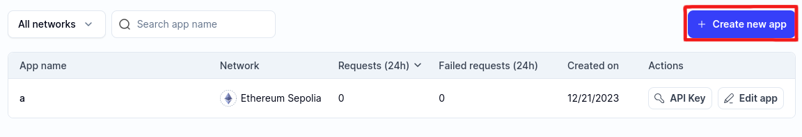
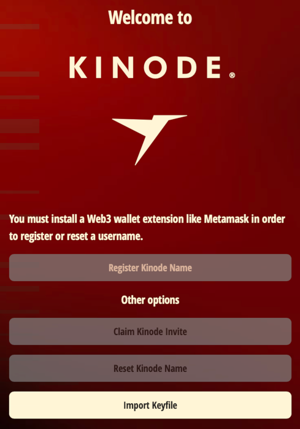
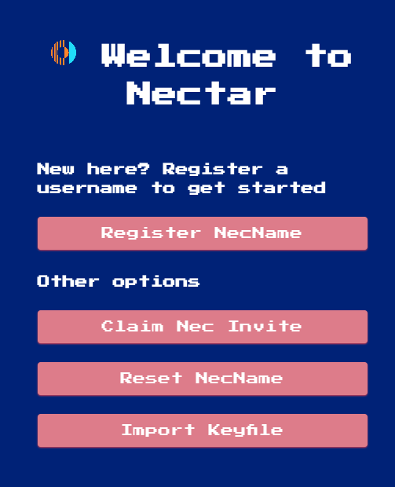
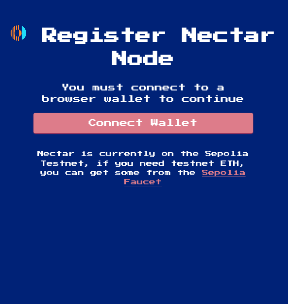
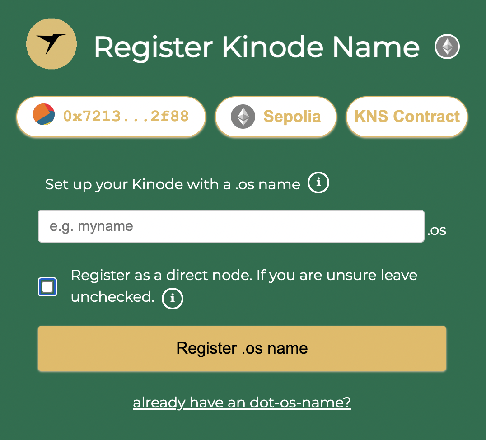
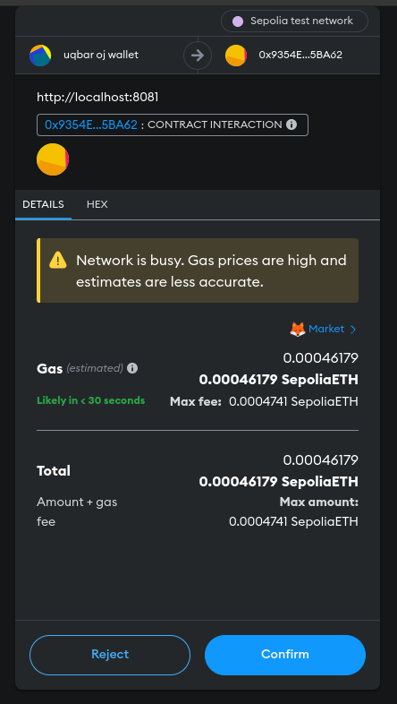
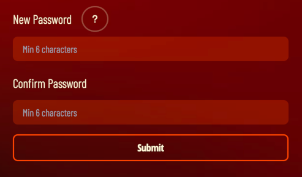
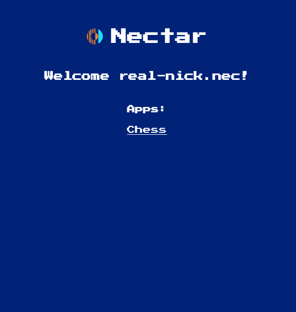

# Join the network

Let's get onto the live network!

This process will only become easier with time.
For now, the Uqbar network posts identities to the Ethereum Sepolia testnet.

## Creating an Alchemy Account

Below, Alchemy is used as an [Ethereum RPC endpoint](#acquiring-an-rpc-api-key) and to use a [faucet for Sepolia testnet ETH](#acquiring-sepolia-testnet-eth).
The Ethereum RPC endpoint and Sepolia ETH are required to send and receive Ethereum transactions that back the Uqbar identity system.
Before going any further, register an [Alchemy account](https://www.alchemy.com/).
There is no cost and no need to register credit card information -- just an email registration.

## Starting the Uqbar node

Start an Uqbar node using the binary built in the [previous section](./install.md).
Locating the binary on your system, take a look at the arguments it accepts:

```bash
$ ./uqbar --help
A General Purpose Sovereign Cloud Computing Platform

Usage: uqbar [OPTIONS] --rpc <WS_URL> <home>

Arguments:
  <home>  Path to home directory

Options:
      --port <PORT>   First port to try binding [default: 8080]
      --rpc <WS_URL>  Ethereum RPC endpoint (must be wss://)
  -h, --help          Print help
  -V, --version       Print version
```

A home directory must be supplied -- where the node will store its files.
The binary also takes a required `--rpc` flag.
The `--rpc` flag is a `wss://` WebSocket link to an Ethereum RPC so the Uqbar node can send and receive Ethereum transactions -- for now used for the identity system.
And finally, by default, the node will run at port 8080; this can be modified with the `--port` flag.

### Acquiring an RPC API Key

Create a new "app" on [Alchemy](https://dashboard.alchemy.com/apps) on the Ethereum Sepolia network.



Copy the WebSocket API key from the API Key button:


### Running the Binary

Replace the `--rpc` field below with the WebSocket API key link copied from [above](#acquiring-an-rpc-api-key), and start the node with:

```bash
./uqbar home --rpc wss://eth-sepolia.g.alchemy.com/v2/<your-api-key>
```

A new browser tab should open, but if not, look in the terminal for a line like

```
login or register at http://localhost:8080
```

and open that `localhost` address in a web browser.

## Registering an Identity

Next, register an identity.
If the page looks like:



then proceed to [Acquiring a Wallet](#acquiring-a-wallet).
Otherwise, if the page looks like:



the browser already has a supported wallet installed.
Click `Register UqName` and proceed to [Connecting the Wallet](#connecting-the-wallet).

### Aside: Acquiring a Wallet

To register an identity, we must send an Ethereum transaction, which requires ETH and a wallet.
Below we use Metamask.
Install Metamask [here](https://metamask.io/download/).

### Connecting the Wallet

Click to `Connect Wallet` and follow wallet prompts:



### Aside: Acquiring Sepolia Testnet ETH

Using the Alchemy account [registered above](#creating-an-alchemy-account), use the [Sepolia faucet](https://sepoliafaucet.com/) to acquire Sepolia ETH.
Then, returning to the Uqbar node,

### Direct vs Routed?

We recommend using a routed node (i.e. leave the check box unchecked):



A routed node connects to the network through a router.
A router is a node that serves as an intermediary, passing packets from sender to receiver.
Routers make connecting to the network convenient, and so are the default.
If you are connecting from a laptop that isn't always on, or that changes WiFi networks, use a routed node.

The other option is a direct node.
A direct node connects directly, without intermediary, to other nodes (though they may, themselves be using a router).
Direct nodes may have better performance, since they remove a middleman from connections.
Direct nodes also reduces the number of third parties that know about the connection between your node and your peer's node (if both you and your peer use direct nodes, there will be no third party involved).

We advise you use a routed node unless you are familiar with running servers.
A direct node must be served from a static IP and port, since these are registered on the Ethereum network and are how other nodes will attempt to contact you.

All packets, passed directly or via a router, are end-to-end encrypted.
Only you and the recipient can read messages.

As a direct node, your IP is published on the blockchain.
As a routed node, only your router knows your IP.

### Sending the Registration Transaction

After clicking `Register Uqname`, click through the wallet prompts to send the transaction:




### What Does the Password Do?

The password encrypts the node's networking key.
The networking key is how your node communicates securely with other nodes, and how other nodes can be certain that you are who you say you are.



## Online at Last

After setting the node password, you will be greeted with the homepage.
For now, there is a p2p `Chess` app, but the possibilities are limited only by your imagination.



What will you build?
